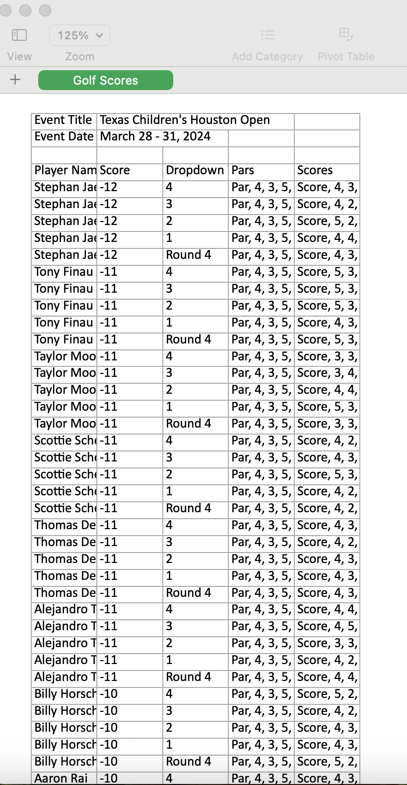

# 🏌️‍♂️ Web Scraping Dynamic Golf Leaderboards with Puppeteer

Web scraping is one of the most versatile skills in a data scientist’s toolkit—especially when the data lives behind interactive frontends, dynamic dropdowns, and client-side rendering.

This project demonstrates how I used **Node.js**, **Puppeteer**, and **ExcelJS** to scrape live golf tournament data from a dynamic leaderboard site and convert it into clean Excel files ready for analysis.

---
## 🎥 Demo Video

<iframe width="100%" height="400" src="https://www.youtube.com/embed/_8_NDOIyDBo" frameborder="0" allowfullscreen></iframe>
---

## 🛠️ What It Does

- Navigates to a dynamic tournament leaderboard site
- Scrapes:
  - Event title and date
  - Player names and top-level scores
  - Hole-by-hole data across multiple dropdown selections
- Writes all structured data to a multi-row Excel file using ExcelJS
- Automates scraping across multiple URLs with delays

---

## 🧪 Key Technologies

- [Puppeteer](https://pptr.dev/): Controls a Chromium browser to interact with web pages like a human user—clicking, waiting, and navigating DOM elements
- [ExcelJS](https://github.com/exceljs/exceljs): Generates `.xlsx` spreadsheets directly from Node.js
- Vanilla JavaScript and async/await for control flow

---

## 📋 Step-by-Step Overview

### 1. Launch a Puppeteer Browser Instance

```js
const browser = await puppeteer.launch({ headless: false });
const page = await browser.newPage();
await page.goto(url);
````

* `headless: false` is used for visibility while debugging
* Puppeteer acts like a real user: it loads JavaScript, interacts with DOM elements, and respects async content

---

### 2. Extract Static Content

We grab the event title and date using `page.$eval`:

```js
const eventTitle = await page.$eval('.Leaderboard__Event__Title', el => el.innerText.trim());
const eventDate = await page.$eval('.Leaderboard__Event__Date', el => el.innerText.trim());
```

---

### 3. Expand and Scrape Each Player Row

Player rows are clickable and expandable. We click, wait, and then scrape the data:

```js
await expandableRows[i].click();
await delay(1000);
const playerName = await expandableRows[i].$eval('.AnchorLink.leaderboard_player_name', node => node.innerText.trim());
```

---

### 4. Handle Dropdown Menus for Detailed Data

Each player has a dropdown menu with multiple scorecards (e.g., different rounds or courses). Puppeteer interacts with each:

```js
await page.select(dropdownSelector, value);
await delay(1000);
```

We then grab pars and scores with:

```js
const newPars = await page.evaluate(() => {
  return Array.from(document.querySelectorAll('.Scorecard__Score')).map(span => span.innerText.trim());
});
```

---

### 5. Write Data to Excel

Using ExcelJS, we create rows dynamically:

```js
worksheet.addRow([
  player.playerName,
  player.score,
  dropdownValue,
  player.pars[index].join(", "),
  player.scores[index].join(", ")
]);
```

---

## 🔄 Automating Across Multiple Tournaments

Finally, we scrape multiple tournament URLs by chaining `await scrapeGolfSite(url, filename)` calls and inserting delays between them to be respectful to the host site.

---
## 📊 Output Snapshot

Here’s what the scraped data looks like once exported to Excel:




This raw output will need to be parsed to extract meaningful insights—like comparing scores to pars, analyzing round-over-round performance, or reshaping the data for dashboards or modeling.

---
## 🚀 Why This Matters

This isn’t just about scraping. It’s about **unlocking data that’s hidden behind interactions** and putting it into the hands of analysts, fans, coaches, and media teams who need it—without waiting for an API.

Absolutely—here’s a shorter, sharper version of that section, focused on the idea of this scraper as the **first step in a full data insights pipeline**:

---

## 🔄 From Scraping to Insights

This project isn’t just about collecting data—it’s the **first step in a full data insights pipeline**.

Once we have structured tournament and player data, we can:

* **Feed it into dashboards** for real-time performance tracking
* **Automate weekly reports** for fans, analysts, or fantasy leagues
* **Train models** to predict player outcomes or uncover scoring patterns
* **Enrich it with other data** (e.g., weather, course difficulty) for deeper context

With the right pipeline, scraped data becomes more than a spreadsheet—it becomes fuel for decisions, products, and stories.

---

Let me know if you'd like a follow-up post or visual showing that pipeline end-to-end.


Web scraping, when done ethically and responsibly, is a form of empowerment.

---